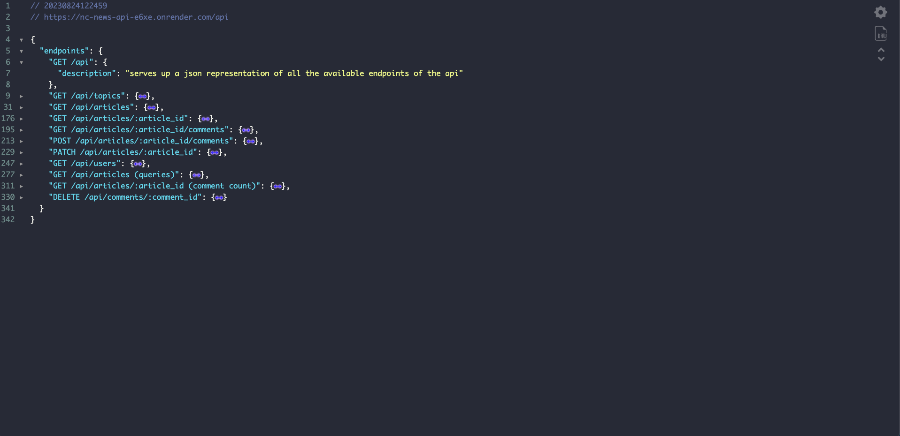

# **Northcoders News API**

## <ins>Summary</ins>

This project is part of my portfolio whilst enrolled on the NorthCoders Software Engineering bootcamp. I am creating a RESTful API for a news website.

It uses Express, PostgreSQL, and the interaction with the database was done using node-postgres.

---

## <ins>Hosted Version</ins>

Firstly, I would recommend installing the [JSON viewer](https://chrome.google.com/webstore/detail/json-viewer/gbmdgpbipfallnflgajpaliibnhdgobh) chrome extension that will display the JSON data in a nicely formatted way.

You can find the hosted version of the API here - https://nc-news-api-e6xe.onrender.com/

The list of available endpoints can be found here - https://nc-news-api-e6xe.onrender.com/api

---

## <ins>Screenshots</ins>

---

## <ins>Tech Stack</ins>

- Express
- JavaScript
- Jest
- PostgreSQL

---

## <ins>Local Setup</ins>

1. To clone the repo, open up your terminal and run git clone https://github.com/mandeep-s1ngh/be-nc-news.git - once you have it cloned, move the folder to your usual directory for projects (if necessary).

2. You can then open up the folder in your code editor of choice and run `npm install` to install all the dependencies.

3. You would need to have PostgreSQL installed which will fire up a PostgreSQL server up once installed and allow you to setup the databases (info can be found further below).

---

## <ins>Environment Variables</ins>

Once that is done, You will need to define the `PGDATABASE` environment variable which is used by PSQL to define the name of the databases to be used for the API.
There are two databases: one for the test data and one for the dev data.
To set up the environment variables, please create the following two files in the root of the project:

1. `.env.test` which will need to contain the following line of code: `PGDATABASE=nc_news_test`.

2. `.env.development` which will need to contain the following line of code: `PGDATABASE=nc_news`

---

## <ins>Setup and Seed the local databases</ins>

You can then proceed to setup and seed the databases by opening a terminal inside the root of the project then:

1.Setup the databases: `npm run setup-dbs`

2.Seed the databases: `npm run seed`

---

## <ins>Running the Test Suite</ins>

[Jest](https://jestjs.io/) and [Supertest](https://github.com/ladjs/supertest) are used for the test suite and if you would like to run the tests associated with each endpoint.

You can run the test file by opening a terminal in the root of the project and run `npm test app.test.js`

You can append **.only** (which is a Jest global) to a describe block to run the tests associated with a specific endpoint or to an it block to run a specific test.

---

## <ins>Interacting with the endpoints</ins>

You can run `npm start` to start the server and use something like [Insomnia](https://insomnia.rest/) to interact with the endpoints, send requests and recieve responses.
